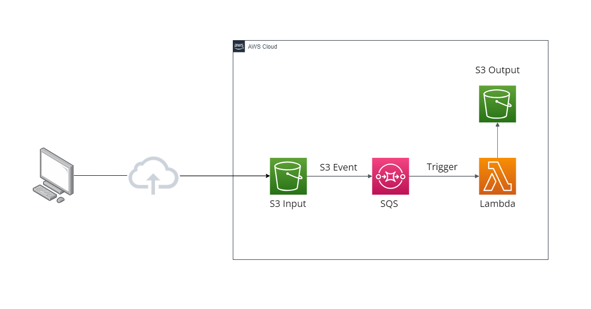
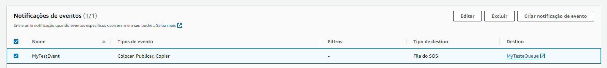
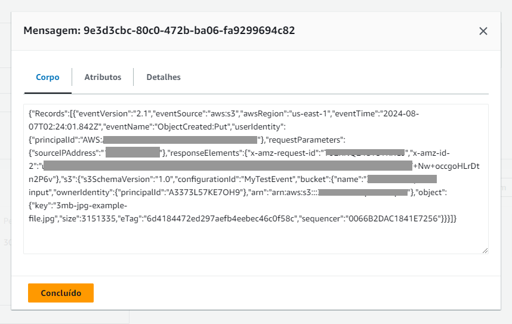
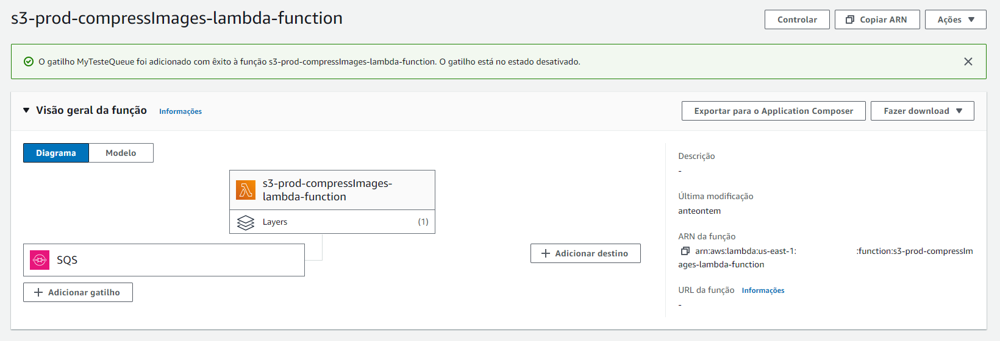

# Compressão de Imagens com AWS Lambda
Utilizando AWS Lambda para Compressão Automática de Imagens via Fila SQS

### 📋 Pré-requisitos

```
Node v18+
AWS Lambda Function
S3
SQS Queue
IAM Role (CloudWatch Logs, Lambda, SQS e S3)
```

### 🔧 Configuração

Crie:

- Uma **função Lambda** para executar a compressão.  
- Uma **fila SQS** para receber os eventos do S3.  
- Dois **buckets S3**: um de entrada (*input*) e outro de saída (*output*).  

### ⚙️ Executando 

O fluxo ocorre automaticamente: sempre que uma imagem é carregada no bucket de entrada, um evento do S3 é enviado à fila SQS. A fila aciona a função Lambda, que processa e comprime a imagem, salvando o resultado no bucket de saída.

## Arquitetura do Projeto

Este projeto criou uma solução para compressão automática de imagens utilizando AWS Lambda, S3 e SQS. A arquitetura foi projetada para otimizar o processamento de imagens, garantindo tanto eficiência quanto escalabilidade.



### 🛠️ Construído com
* [AWS SDK Javascript v3](https://docs.aws.amazon.com/AWSJavaScriptSDK/v3/latest/client/lambda/command/InvokeCommand/)
* [Sharp](https://www.npmjs.com/package/sharp)

### Explicação

As imagens são enviadas para um bucket S3 de entrada, sempre que um novo arquivo é carregado, um evento S3 é gerado e enviado para uma fila SQS. O AWS Lambda, ativado pelos eventos da fila, recupera o arquivo do bucket de entrada, realiza a compressão e salva o arquivo comprimido em um bucket de saída.

Benefícios:

O uso do SQS permite uma gestão eficiente do processamento assíncrono e escalável das imagens. A fila controla a quantidade de requisições simultâneas ao Lambda, ajustando-se automaticamente à demanda, o que melhora o desempenho e a capacidade de resposta do sistema.

Detalhes da Implementação:

A função Lambda é implementada utilizando Node.js 18.x e a biblioteca Sharp. A compressão é aplicada a imagens PNG e JPEG/JPG, reduzindo a qualidade para 60%. Para configurar essa arquitetura, foram criados dois buckets S3: um para entrada e outro para saída dos arquivos comprimidos. Após a criação dos buckets, um evento S3 foi configurado para enviar notificações para a fila SQS.



Por padrão, a cada evento POST ou PUT no S3, uma mensagem é enviada para o SQS com os detalhes da ação, incluindo a "Key" do arquivo.



A fila SQS é configurada como gatilho para a função Lambda. Cada nova mensagem no SQS aciona automaticamente o Lambda, que processa a mensagem e realiza a compressão com o Sharp.



### Resultado:

Esta estrutura permite a migração e compressão de imagens de qualquer origem para o S3, garantindo eficiência e economia. A fila SQS controla a taxa de requisições ao Lambda, mantendo a cota de simultaneidade protegida, com um limite configurável de até 1000 chamadas simultâneas. Além disso, o Lambda oferece uma cota gratuita mensal, permitindo até 170.000 requisições de 3000 ms (Tempo) e 768 MB (Memória) cada, sem custo adicional para esse projeto.

Exemplo de um resultado da compressão:

Original (10mb)


Comprimida (1mb)

Designed by Freepik
